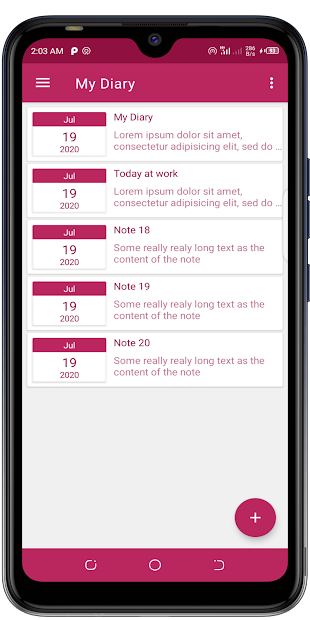
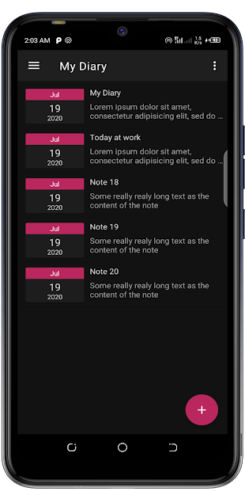
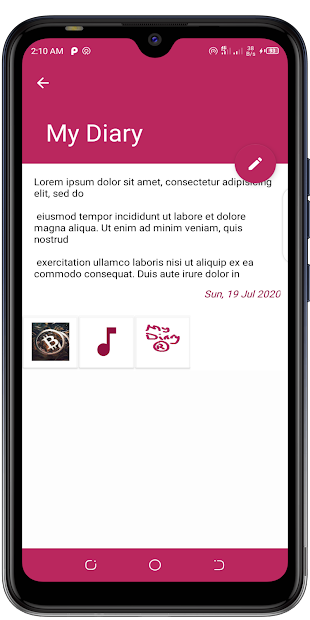
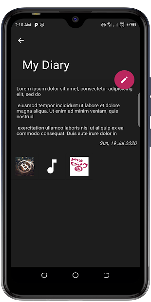

# MyDiary
Android App for managing personal information

## Google Play Store
You can view the app on Play Store [here](https://play.google.com/store/apps/details?id=com.idea.mydiary)

## Language and Libraries
- Java
- Native Android SDK

## Installation
Clone the repository and open it in android studio.
```bash
git clone https://github.com/dodziraynard/MyDiary2.git
```

## Running
Just run/build the project in android studio!

## Screenshots




