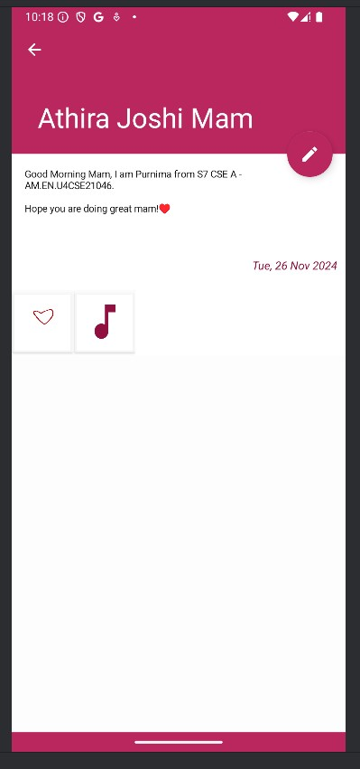

# MyDiary
Android App for managing personal information

## Language and Libraries
- Java
- Native Android SDK

## Installation
Clone the repository and open it in android studio.
```bash
git clone https://github.com/purnimasharma04/19CSE463-Mobile-App.git
```

## Running
Just run/build the project in android studio!

## Screenshots




